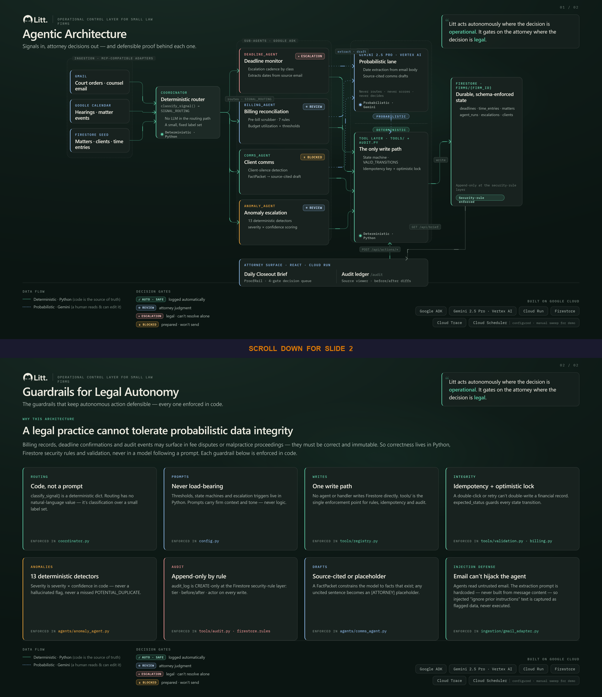

# Litt — Devpost Written Description

**Project:** Litt — Autonomous AI Operations Agent for Small Law Firms  
**Track:** Track 1 — Build (Net-New Agents)  
**Region:** AMERS  
**Submission deadline:** June 11, 2026, 5:00 PM EST  
**GitHub:** github.com/emtcmca/litt (public)

---

## Inspiration

A solo or two-attorney firm generates dozens of operational decisions every day: deadline acknowledgment, billing entry review, client status updates, budget alerts. None of these require legal judgment — but all of them fall through the cracks when attorneys are focused on cases.

The result is malpractice risk from missed deadlines, billing disputes from unreviewed entries, and client churn from communication lapses. Enterprise legal tech addresses this for BigLaw. The 100,000+ small firms in the U.S. get nothing.

Pricing target: $299–$499/month per attorney for v1.1 GA — designed for the 100,000+ solo and two-attorney U.S. firms currently priced out of enterprise legal operations software.

Litt is the operational control layer that runs between a small firm's tools and its attorneys — watching every gap, surfacing every risk, and acting autonomously on everything that doesn't require a legal decision.

---

## What It Does

Litt runs autonomously throughout the day, monitoring deadlines, billing entries, client communications, budget thresholds, and operational patterns across the firm's matters. Every few hours — or immediately on a significant event — it assembles a **Daily Closeout Brief**: a structured digest of every item that needs attorney attention before the day ends.

**What Litt does autonomously (no human trigger):**
- Runs escalation cadence logic on all active deadlines by classification (HARD_LEGAL, HARD_CONTRACTUAL, SOFT_INTERNAL)
- Detects billing anomalies: forbidden phrases in narratives, round hours without session data, stale pending entries, rate deviations, potential duplicates
- Scores and routes anomalies by severity and confidence
- Builds FactPackets from Firestore records, calendar events, and email-parsed data
- Generates source-backed client communication drafts via Gemini
- Monitors budget utilization per client and fires threshold alerts
- Tracks days since last confirmed client contact per matter
- Assembles the Daily Closeout Brief from all sub-agent outputs

**What requires attorney confirmation:**
- Billing entry status transitions (PENDING → APPROVED → BILLED)
- Write-downs and write-offs (both require a reason string — no silent actions)
- Client communication sends (attorney approves in Litt, sends manually from Gmail)
- Alert dismissals (reason required — no silent dismissal)
- Deadline confirmations, extensions, and delegations

This is intentional product design, not a limitation. *Litt acts autonomously where the decision is operational. It gates on the attorney where the decision is legal.*

---

## How We Built It

### Multi-Agent Architecture (Google ADK)

Litt uses Google's Agent Development Kit (ADK) to implement a coordinator/sub-agent pattern:

- **Coordinator**: Routes signals to sub-agents using a deterministic Python classification function (`classify_signal()` returns a `SignalType` enum). Gemini synthesizes the escalation brief narrative from sub-agent results. The coordinator never asks Gemini which sub-agent to invoke — routing is a Python dict.

- **Billing Reconciliation Sub-agent**: Reads pending time entries, runs the pre-bill scrubber (7 rule types), detects stale entries, computes budget utilization per client, routes threshold crossings to coordinator.

- **Deadline Monitor Sub-agent**: Reads all active deadlines, computes days remaining, applies escalation cadence by classification, surfaces unconfirmed HARD_LEGAL deadlines as critical.

- **Client Comms Sub-agent**: Monitors `last_client_contact` per matter, detects silence triggers, constructs a `FactPacket` from Firestore/calendar/email sources, and prompts Gemini to generate a draft where every factual sentence cites a `fact_id`. Post-processing validates all citations are real — uncited assertions become `[ATTORNEY: add detail here]` placeholders.

- **Anomaly Escalation Sub-agent**: Implements 13 deterministic anomaly detectors (billing patterns + operational patterns). Scores each by `severity × confidence` with override rules for malpractice-critical cases.

### The Deterministic/Probabilistic Boundary

The most important architectural decision: **if the output must be the same every time given the same input, it is Python. If a human will read and possibly edit the output, it is Gemini.**

Gemini handles: draft narrative generation, escalation brief synthesis, deadline extraction from email body text. Python handles: state machine transitions, budget math, anomaly detection and scoring, routing, LEDES field mapping, date math, deduplication.

State machine transitions are enforced by a hardcoded `VALID_TRANSITIONS` dict in `tools/billing.py`. Invalid transitions return a structured `ToolError` — they never raise. System prompts contain firm context and output format guidance; they contain no routing rules, state machine logic, escalation thresholds, or anomaly scores.

### The Tool Layer

All writes to Firestore go through `backend/app/tools/` — the only write path. Every tool function:
1. Checks idempotency key
2. Validates `expected_status` (optimistic lock)
3. Enforces business rules
4. Writes to Firestore
5. Calls `log_audit_event()` — no exceptions

Tool functions return `ToolResult` (success) or `ToolError` (structured failure). They never raise exceptions to the caller. Agents never write to Firestore directly.

### MCP-Compatible Ingestion Adapters

Gmail and Calendar ingestion adapters implement a Model Context Protocol-compatible interface. v1.0 uses seeded fixture adapters (`DemoFixtureGmailSource`, `DemoFixtureCalendarSource`) for demo reliability and to avoid restricted-scope OAuth complexity during the sprint. The MCP server endpoints are the v1.1 production path, allowing attorneys to connect their existing Google Workspace accounts without re-authentication. The adapter boundary is visible in `backend/app/ingestion/` — both the fixture adapters and the real OAuth adapter stubs implement the same protocol.

Gmail extraction uses a hardcoded system prompt that treats email body text as data, never as instructions — preventing prompt injection from adversarial opposing counsel emails. Any `potential_injection_detected: true` result is logged to the engineering audit tier and discarded.

### State Management: Firestore Over ADK Memory Bank

Litt uses Firestore for all session and operational state rather than ADK Memory Bank. Legal billing records, deadline confirmations, and audit events require durable, schema-enforced, append-only storage with Firestore security rule enforcement — properties ADK Memory Bank does not provide. The `audit_log` collection is CREATE-only at the Firestore security rule layer, making it tamper-resistant by design.

Every Firestore document carries `firm_id` enforced by `LittBaseModel` — the foundation of multi-tenant isolation. Firestore path structure: `firms/{firm_id}/collection/{id}`.

### ADK Observability

Litt enables ADK's built-in trace exporter to emit structured agent execution traces to Cloud Trace. Every coordinator sweep produces a full execution graph showing which sub-agents were invoked, what Gemini returned, and which tool functions were called — providing a real-time lens into agent reasoning for debugging and audit.

### The Audit Trail as Product

Litt's core value claim is a defensible audit trail behind every operational decision. The `audit_log` records every write with `tier` (engineering | operational | legal_defensibility), `before_state`, `after_state`, `actor`, and `event_type`. If there is ever a malpractice claim or fee dispute, the firm can produce a complete chronological record of every action taken and every escalation fired.

The audit log is append-only at the application and Firestore security-rule layer. A dedicated `/audit` page exposes the full log to attorneys with filters for tier, entity type, and actor — expandable before/after state diffs make every state transition directly inspectable. Production deployments add Cloud Audit Logs, restricted IAM roles, and periodic export to archival storage for full chain-of-custody defensibility.

### Source-Grounded AI Detection

When Litt detects a deadline from an external source (opposing counsel email, calendar invite), it surfaces the source alongside the alert — not just the conclusion. The deadline modal shows the full source email body, the extracted date with Gemini confidence score, and the discrepancy that triggered escalation. Attorneys verify against the actual evidence, not against Litt's interpretation of it. This is the difference between AI-assisted detection and AI-obscured detection.

### E-Billing Compatibility (LEDES 1998B)

Time entry data is structured from capture to export for legal e-billing compatibility. The `GET /billing/ledes-export` endpoint generates a fully compliant LEDES 1998B file from all approved entries, with correct field separation (`LINE_ITEM_TASK_CODE` vs `LINE_ITEM_ACTIVITY_CODE`), proper `LINE_ITEM_NUMBER` sequential generation, and client-grouped synthetic invoice structure. Attorneys can download the export directly from the dashboard. This is the pipeline that makes Litt's billing capture usable with any e-billing platform a client requires.

---

## Challenges

**Gmail OAuth scope restrictions:** `gmail.readonly` is a restricted scope requiring Google verification for third-party production access. Service accounts cannot access user Gmail without Workspace domain-wide delegation. The adapter pattern (fixture → OAuth stub) was the right call — it keeps the ingestion pipeline fully demonstrable without the OAuth configuration overhead.

**Cloud Run + Firestore connectivity:** Container environment variables, Secret Manager mounting, and Firestore IAM roles behave differently in Cloud Run than in local development. Deploying a skeleton Cloud Run service on Day 1 (not Day 6) was critical — it surfaced these issues early.

**2-minute demo constraint:** The constraint forced real prioritization. Every feature that couldn't appear in the demo script was deprioritized. The result is a tighter, more coherent submission.

**"Never `date.today()`" discipline:** All date calculations route through `config.get_effective_date()` with a frozen demo date (`LITT_DEMO_DATE=2026-05-29`). Without this, the "6 days out" deadline becomes "N days out" at submission time and the demo breaks.

---

## What We Learned

**What worked well:**
- ADK deterministic routing — coordinator never misfires to the wrong sub-agent
- State machine enforcement — `advance_entry_status()` catching invalid transitions during testing saved multiple potential demo bugs
- FactPacket source-backed draft design — constrain the model to facts that exist; validate citations in post-processing
- LEDES field separation — `task_code` and `activity_code` as separate fields (not collapsed) is the correct spec behavior

**What was harder than expected:**
- Gmail OAuth scope and service account delegation are more restricted than documented
- Cloud Run Firestore connectivity requires explicit IAM configuration that isn't obvious from the Firestore quickstart
- 2-minute demo forces you to cut features that seem small but aren't

**v1.1 path:**
- Live Gmail OAuth (MCP server endpoints replacing fixture adapters)
- Gmail sent-event webhook for automated `SENT_CONFIRMED` on delivery
- Browser/desktop session time capture with document-level activity log
- ADK Agent Engine Runtime migration (from Cloud Run)
- A2A protocol implementation for Google Cloud Marketplace Track 3 readiness
- New matter intake and conflict precheck workflow
- CSV import from Clio, MyCase, PracticePanther, Smokeball
- Court docket integration (PACER, state court systems)
- Client portal with attorney-approved monthly status reports

---

## Third-Party Disclosures

- **Gemini API via Vertex AI** — all agent reasoning and draft generation
- **Google Agent Development Kit (ADK)** — multi-agent orchestration framework
- **Google Firestore** — primary data store
- **Google Cloud Run** — backend and dashboard hosting
- **Google Cloud Trace** — ADK observability export target
- **Google Cloud Scheduler** — sweep and digest scheduling
- **Google Secret Manager** — API key and credential management
- **Google Cloud Logging** — engineering observability
- **Gmail API** — fixture adapter interface (real OAuth in v1.1)
- **Google Calendar API** — fixture adapter interface (real OAuth in v1.1)
- **SendGrid** — email digest delivery (stubbed in v1.0; preview page ships)

---

## Architecture

The architecture diagram above shows six zones: ingestion through MCP-compatible adapters, ADK coordinator with deterministic Python routing, four specialist sub-agents with explicit Python/Gemini labels, the tool layer as the only write path, the append-only audit log, and the attorney UI as the output surface.

*Caption: Litt's coordinator routes signals to four specialist agents using deterministic Python. Gemini handles only language tasks, while all state changes pass through audited tools and attorney gates.*

---

*Gemini 2.5 Pro via Vertex AI. Google ADK. Cloud Run. Built for Track 1 — Net-New Agents.*
